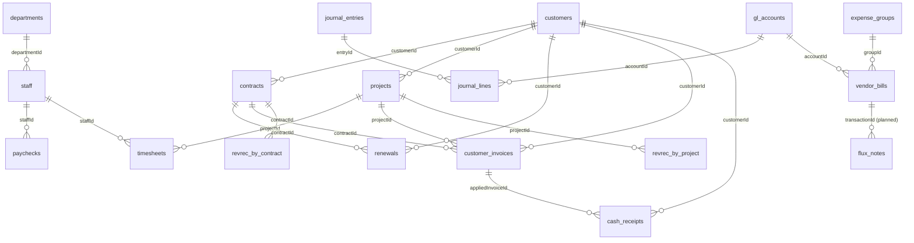

# Bearing data — schema & data dictionary

The schema behind the CSVs in this folder (and behind Dogfood's spine). Two kinds of table:

- **Base records** — the source-of-truth rows (what a Supabase build would store). Layer 1 in the
  five-layer model.
- **Derived views** — computed from the base records (statements, metrics, recognition splits,
  series). Not stored; reproducible from the base + the drivers. Marked _(derived)_ below.

Everything ties to the **general ledger**: `gl_accounts` + `journal_lines` roll up — via the
`statement_line` Account Mapping — into the three statements. Money is USD, exported as plain decimal
major units. `period` = `YYYY-MM`; `date` = `YYYY-MM-DD`; `pct` = fraction (0.71 = 71%).

## Entity relationships

## Config / mapping

### firm — the tenant
`id` (pk) · `name` · `short_code`. Single-tenant for the demo (Bearing).

### settings — period & close config
`currency` · `fiscal_year_start_month` (1) · `close_through` (month — last closed) · `in_close_month` ·
`forecast_horizon_start` · `forecast_horizon_end`. The global as-of boundary every surface reads.

### departments
`id` (pk) · `name` · `function` (enum: direct | rnd | sm | ga).

### expense_groups
`id` (pk) · `label` · `classification` (enum: cost_of_revenue | operating_expense) · `function` · `order`.

### gl_accounts  — the chart of accounts + Account Mapping  → `gl_accounts.csv`
`id`/`code` (pk) · `name` · `account_type` (asset | liability | equity | contra_equity | revenue |
cost_of_revenue | operating_expense | other_income | tax) · `classification` · `function` ·
**`statement_line`** (fk → the P&L/BS line this account maps to — the Account Mapping seam).

## Layer 1 — source records

### customers  → `customers.csv`
`id` (pk) · `name` · `segment` (starter | growth | scale) · `start_month` · `status` (active | churned) ·
`arr` (money — run-rate; Σ active === exit ARR).

### contracts  → `contracts.csv`
`id` (pk) · `customer_id` (fk → customers) · `customer_name` · `stream` (subscription | services) ·
`plan_tier` · `arr` · `start_month` · `term_months` · `status` · `booking_type` (new | expansion | contraction).

### pipeline  → `pipeline.csv`
`id` (pk) · `customer_name` · `stream` · `stage` (lead | qualified | proposal | negotiation | closed_won |
closed_lost) · `arr` · `owner` · `expected_close` · `probability` (pct).

### renewals  → `renewals.csv`
`id` (pk) · `contract_id` (fk → contracts) · `customer_id` (fk → customers) · `due_month` ·
`arr_up_for_renewal` · `status` (open | renewed | expanded | contracted | churned).

### projects  → `projects.csv`
`id` (pk) · `name` · `customer_id` (fk → customers) · `status` (not_started | in_progress | complete |
on_hold) · `pct_complete` (pct) · `contract_value` · `wip` (unbilled contract asset) · `margin_pct`.

### staff  → `staff.csv`
`id` (pk) · `name` · `department_id` (fk → departments) · `function` · `title` · `start_month` ·
`end_month` (null if active) · `fte` · `annual_base_comp` (burden lives in the Employee Expenses group).

### journal_entries / journal_lines  → `journal_lines.csv` (flattened)
**journal_entries**: `id` (pk) · `period` · `memo` · `doc_ref` · `source` (invoice | payroll | ap_bill |
depreciation | prepaid_amort | manual). **journal_lines**: `entry_id` (fk) · `account_id` (fk →
gl_accounts) · `debit` · `credit`. Every entry balances (Σ debit === Σ credit). Granularity is
monthly-summary per source — drill to individual transactions via the sub-ledger below.

## Layer 1 — transaction sub-ledger (lowest level)

> Each stream explodes a monthly driver into individual documents: Σ(rows in a month) === the driver,
> so the GL/statements are unchanged. Each row has a **stable `id`** (the flux-note anchor).

### vendor_bills (expense_transactions)  → `vendor_bills.csv`
`id` (pk) · `period` · `account_id` (fk → gl_accounts) · `group_id` (fk → expense_groups) · `function` ·
`vendor` · `amount` · `memo`. (Full export also carries `doc_number` / `date` / `due_date` / `status`.)
Σ per (account_id, period) === that account's monthly GL activity.

### paychecks  → `paychecks.csv`  — salary, paycheck by paycheck
`id` (pk) · `doc_number` · `staff_id` (fk → staff) · `period` · `period_label` · `date` · `gross_pay` ·
`employee_taxes` · `benefits` · `net_pay`.

### timesheets  → `timesheets.csv`  — labor, timesheet by timesheet
`id` (pk) · `doc_number` · `staff_id` (fk → staff) · `project_id` (fk → projects) · `period` · `date` ·
`week_label` · `hours` · `bill_rate` · `cost_rate` · `billable_value` (hours × bill rate → services
revenue) · `labor_cost` (hours × loaded cost rate → job-cost).

### customer_invoices  → `customer_invoices.csv`
`id` (pk) · `doc_number` · `customer_id` (fk) · `contract_id` (fk) · `project_id` (fk) · `period` ·
`date` · `due_date` · `status` (open | paid) · `stream` · `kind` (new_term | increment | refund |
services_progress | opening_balance) · `amount`.

### cash_receipts  → `cash_receipts.csv`
`id` (pk) · `doc_number` · `customer_id` (fk) · `period` · `date` · `applied_invoice_id` (fk →
customer_invoices, FIFO) · `applied_doc_number` · `amount`.

## Derived views _(computed, not stored)_

### revrec_by_contract  → `revrec_by_contract.csv` _(derived)_
Subscription 606 recognition, **per contract per month**: `contract_id` (fk) · `customer_id` ·
`customer_name` · `tier` · `period` · `recognized` · `deferred` · `arr`. Σ per month === the
subscription revenue line.

### revrec_by_project  → `revrec_by_project.csv` _(derived)_
Services %-complete recognition, **per project per month**: `project_id` (fk) · `project_name` ·
`period` · `recognized`. Σ per month === the services revenue line.

### gl_account_monthly  → `gl_account_monthly.csv` _(derived)_
`period` · `account_code` (fk) · `natural_activity` (debit-normal: dr−cr; credit-normal: cr−dr). Pivot
for any account's monthly movement.

### driver_series_monthly  → `driver_series_monthly.csv` _(derived, the master pivot)_
One wide row per month with every driver + balance-sheet series (subscription/services recognition,
ARR/MRR, payroll, CoR, the 8 OpEx groups, SBC, and all BS balances). Best single sheet for trend
analysis.

### pnl_monthly  → `pnl_monthly.csv` _(derived)_
Monthly P&L, long format: `period` · `fiscal_year` · `status` (actual | in_close | forecast) ·
`line_id` · `line_label` · `level` (0 headline / 1 line / 2 nested) · `amount`. FY2024–26.

### dashboard_metrics  → `dashboard_metrics.csv` _(derived)_
The 19 KPI tiles as of Jun 2026: `metric_id` · `label` · `family` · `basis` · `value` · `prior_year` ·
`budget`.

## Planned write tables (not in this export)

- **scenarios / scenario_inputs** — the contained what-if deltas off Base (the scenario engine).
- **budget_snapshots** — the frozen layer-2 driver snapshot the Budget/Variance columns read.
- **flux_notes** — reviewer notes for Flux Analysis, FK'd to a sub-ledger transaction's stable `id`
  (`{ transaction_id, statement_line, period, author, body, amount_at_note, created_at, resolved }`).
  The first user-write store; source records stay immutable. See `import-templates/README.md`.
